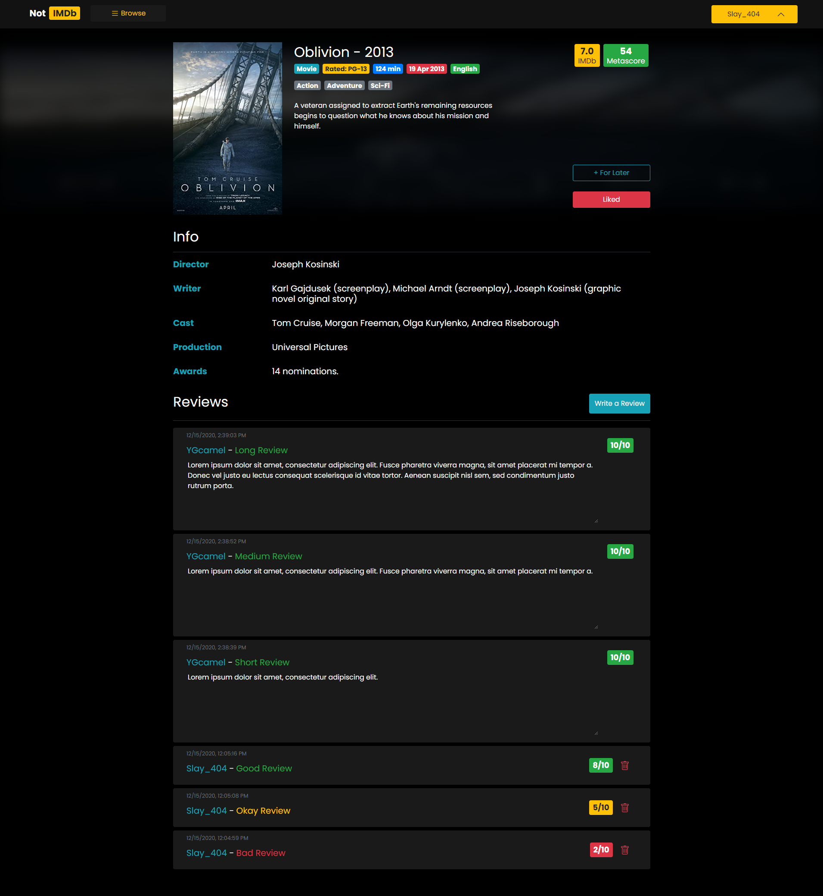

# not-IMDb

A movie database web application developed with the MERN stack.

Live Version: https://not-imdb.herokuapp.com

## Description

This app will let you browse and review movies. I got the idea from a friend who took the class COMP 2406. The project outline can be found <a href="/misc/Project-Outline.pdf" target="_blank">here</a>.

**Key features**
- [x] Search / sort / filter movies.
- [x] User authentication.
- [x] Add / delete reviews.
- [x] Like / save movies.
- [ ] Browse / follow other users
- [ ] Add / delete / edit movies
- [ ] Recommendations on home page
- [ ] Responsive

## Development

I developed the client using React. Used React Router and functional components. Primarily used SASS and Bootstrap to style everything. Used React hooks for state management, and a little bit of Redux for global data such as signed-in user information. Used Axios to make API requests.

Developed REST API using Node and Express. Used MongoDB Atlas for database.

## Screenshots
##### Search Page

##### Movie Page

##### User Profile

### Asset Credits

Default Background by <a href="https://behance.net/antitomi" title="Tomislava Babić" target="_blank">Tomislava Babić</a> from <a href= "https://www.toptal.com/designers/subtlepatterns/">www.toptotal.com</a>

Checked Icon made by <a href="https://www.flaticon.com/authors/kiranshastry" title="Kiranshastry">Kiranshastry</a> from <a href="https://www.flaticon.com/" title="Flaticon"> www.flaticon.com</a>
